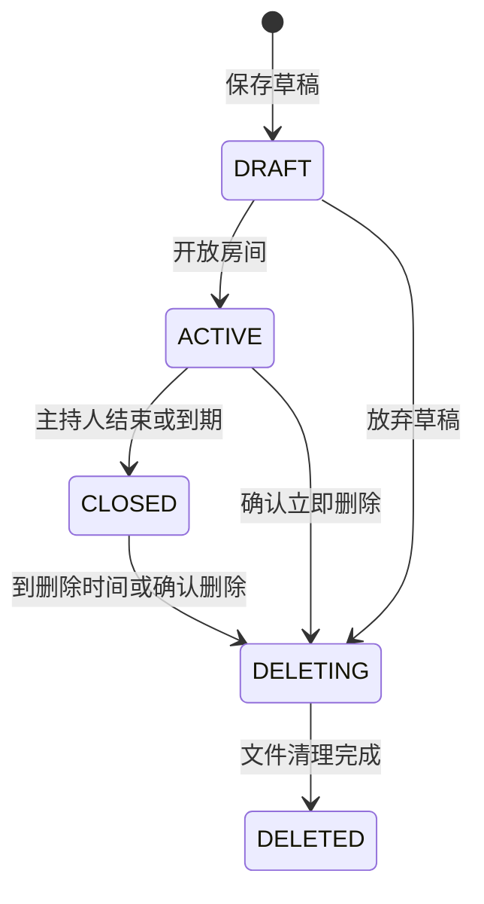

# RoomDeck 产品与开发设计文档

版本：设计提案 1.0 · 2026-09-09  
依据：用户提供的《RoomDeck 产品设计与开发文档》。本文新增的默认值、版本安排、指标与实现方案均为建议基线，尚未通过真实用户或设备验证。UI 为可交互设计原型，不代表后端已实现。

## 1. 产品定义与首发目标

**给现实中的一个房间，再开一个数字房间。** RoomDeck 是自托管的临时多人共享空间。主持人创建活动，参与者扫码进入，照片、文件、链接和便签汇集到同一房间；经允许的内容可实时出现在公共大屏，结束后可导出并按期清理。

优先用户：8–30 人聚会、10–50 人工作坊与小型会议。婚礼、课堂和公开展会是后续验证场景，不以千人活动作为首版承诺。部署者与主持人可能是同一人；参与者不注册、不安装 App。

### 用户任务

|角色|现场问题|最短成功路径|
|---|---|---|
|参与者|大家的照片分散在各自手机|扫码 → 昵称 → 选照片 → 看见成功反馈|
|主持人|不停找链接、收照片、切投影|创建 → 展示二维码 → 管理内容 → 手机切换大屏|
|大屏观看者|不知道如何加入或现在看什么|持续可见的加入提示 + 清晰的当前内容|
|部署者|临时工具维护成本高|容器启动 → 初始化 → 校验地址 → 备份与清理|

### 不进入当前范围

聊天、好友关系、文件夹与同步、在线 Office 编辑、屏幕共享、P2P 大文件直传、白板、插件市场、付费与多租户。模块化先做编译期边界，不提前实现动态插件平台。

## 2. 相较原文的关键调整

|原文中的不确定点|本提案决策|原因|
|投票既在 V0.2 又出现在首版验收|V0.1 不含投票；V0.2 增加，预览单独标识|保持验收与开发范围一致|
|TTL、容量限制排到 V0.4|首版纳入基本限额、清理任务与磁盘保护|否则临时空间无法安全长期运行|
|直接访问 display 路径|主持人授权只读展示会话|知道房间码不等于拥有大屏权限|
|上传即公开、即上屏|分开房间可见与允许上屏；首版提供暂停和撤下|现场大屏放大会误操作的影响|
|四位房间码|六位易读随机码 + 高熵邀请令牌|短码方便口述，令牌用于邀请，不混同账号凭证|
|关闭、保留、删除语义混杂|状态机 + 独立加入开关 + 独立删除时间|明确什么时候停止写入和失去访问|
|链接自动抓取元数据|V0.1 手工标题与域名；V0.2 可选受限抓取|减少服务器访问内网的攻击面|
|视频与照片放在同一能力|V0.1 视频作为附件；不转码、不轮播|兼容性与资源需求可控|
|热备份直接复制 /data|停机完整备份为默认，在线一致性备份后续做|SQLite 与资源文件需要一致的恢复点|

## 3. 版本范围

### V0.1：完成共享与大屏闭环

必做：首次初始化与管理员登录、房间创建/加入/关闭、二维码、昵称会话、照片与文件上传下载、便签与链接、精选上屏、欢迎/照片/精选三种展示、大屏暂停/黑屏、基础成员管理、上传限额、断线恢复、异步导出、自动删除、操作日志。

内置“聚会”“会议”“快速分享”三个配置预设，仅是开关默认值，不含模板编辑器。聚会默认照片/便签/链接/大屏；会议默认文件/便签/链接/大屏；快速分享默认文件/便签/链接。主持人创建前可调整。

### V0.2：增加互动与公开活动控制

单选/多选投票、投票结果展示、点赞、正式审核队列、加入审批、房间密码、Moderator、受限链接元数据抓取。投票预览用于展示扩展方向，不混入 V0.1 交付。

### 后续按需求验证

视频转码、多屏独立控制、展示播放列表、访客回顾链接、主题与海报、相片评选。每个版本以场景验证结果决定，不沿用固定 V0.3–V0.9 功能堆叠时间表。

## 4. 建议默认配置

|配置|默认|边界与说明|
|房间名|必填，1–40 字符|按 Unicode 字符计数，清理控制字符|
|昵称|自动提供昵称，可编辑，1–20 字符|允许重名，用头像色及成员短标识区分|
|房间码|六位，CSPRNG，从易读字符集中生成|不使用 O/0/I/1，唯一索引冲突重试|
|邀请令牌|128 bit 以上随机值|只保存摘要，可轮换；不出现在日志|
|活动时长|12 小时|创建可选 2/6/12/24 小时，最长 7 天|
|结束后保留|24 小时|可选 24 小时/7 天/30 天；首版不默认永久|
|房间人数|50 个未撤销参与者|展示会话不占人数；不等同在线人数|
|照片限制|20 MB/张，60 MP 解码上限|JPEG、PNG、WebP；其他图片作为附件或提示不支持|
|单文件|200 MB|服务器流式处理；安装设置可下调|
|房间总量|2 GB|包含原件、派生文件与临时预留；导出另行预留|
|客户端上传|并发 2，单次最多 20 项|失败可逐项重试，不要求整批重传|
|上屏策略|主持人精选|家庭场景可切换“新照片自动上屏”，明确告知|
|下载原件|关闭|主持人开启前提示原件可能包含拍摄信息|
|展示节奏|10 秒|可选 5/10/20 秒，按需暂停|

这些数字是首轮压测起点，不是性能实测结论。上传配额要按“已用 + 已预留”原子校验，不能只相信客户端申报尺寸。

## 5. 身份、权限与访问边界

部署管理员首次在本机获得初始化入口/一次性引导令牌，完成后永久关闭未认证初始化接口。不能让公网第一个访问者抢注管理员。V0.1 单管理员账户创建多个房间；Host 是房间所有者角色。Guest 使用服务器生成的不可预测会话，昵称仅是显示名称。

|操作|Host|Moderator（V0.2）|Guest|Display|
|---|---|---|---|---|
|创建、结束、删除房间|是|否|否|否|
|查看房间公开内容|是|是|是|仅上屏白名单|
|上传与发布|是|是|房间允许时|否|
|删除自己内容|是|是|活动期间允许|否|
|隐藏/删除他人内容|是|是|否|否|
|精选、撤下、切换大屏|是|是|否|否|
|查看待审核内容|是|是|仅自己的|否|
|踢出/暂停成员上传|是|否，后续可授权|否|否|
|创建整房导出|是|否|否|否|
|下载单件|是|是|房间允许时|仅显示用派生图片|
|修改保留期限/模块/限额|是|否|否|否|

所有 REST、WebSocket、缩略图和下载入口必须在服务端校验房间归属与权限。前端隐藏按钮只改善体验。关闭模块后保留数据，访客不再访问该模块；Host 可在管理端查看并导出。重开模块恢复可见性。

匿名会话只能保证“同一参与者会话的一次投票”，不能保证一个自然人只投一次。清理浏览器、换设备都可能重新加入。实名投票是显示昵称，不是实名身份认证。禁用成员撤销其会话及连接，不能宣称永久封禁自然人。

## 6. 房间生命周期



V0.1 CLOSED 不重新开放，复制配置创建新房间。`join_locked` 是 ACTIVE 的独立开关：停止新成员加入，不影响既有成员上传。`uploads_paused` 只停止上传与新内容发布。不要用一个“锁定”按钮代表三种行为。

`ends_at` 控制自动结束；`closed_at` 记录实际关闭；`delete_at = closed_at + retention_seconds`。UTC 保存与比较，页面按本地时区显示明确日期。已关闭房间调整保留期时基于 closed_at 重新计算，若新期限已过去则要求即时删除确认，不能静默清空。

关闭后：拒绝新成员加入；既有会话可只读到 delete_at；上传、编辑、投票关闭；大屏转为结束页，不再展示加入码。导出、单项下载仍按权限可用。新访客看到“活动已结束，请联系主持人”，不暴露内容。

删除时：先撤销会话和媒体访问，再取消任务、标记 DELETING，异步删除文件及记录；失败可重试，绝不恢复对外访问。DELETED 返回通用 410 页面，不泄露房间名。备份里的历史副本按备份保留政策处理，界面不能声称已擦除外部备份。

## 7. 关键用户流程

### 7.1 部署与第一次创建

容器启动 → 本机初始化 → 登录 → 创建房间 → 选预设 → 输入名称 → 确认结束/删除时间 → 创建。随后展示“邀请参与者”“打开大屏”两项主操作，高级配置折叠。

二维码依赖正确的可访问地址。创建页首次要求检查 BASE_URL 或局域网 IP；`localhost`、容器 IP、`.local` 均不可假设所有手机能访问。给出“用另一台手机扫码测试”的提示。离线局域网可运行静态资源和二维码，不依赖字体/CDN/第三方图库。不同网络的手机需要可路由服务地址；热点客户端隔离也可能阻断连接。

### 7.2 加入

扫码打开带邀请令牌的入口 → 交换邀请能力并清除 URL 令牌 → 展示房间名、结束时间、可见范围 → 昵称 → 加入。邀请页仅展示必要信息，不显示内容预览和成员名单。通过房间码加入采用实例入口中的输入框；逐 IP 与实例全局限速，失败统一提示“房间不存在或暂不可加入”。公开短码模式适用于可信现场；更敏感房间可关闭短码加入，仅保留高熵邀请。

同浏览器再次打开恢复会话；昵称修改不生成新参与者。无有效会话时重新走加入。达到人数上限、停止加入、到期、会话撤销分别给出可理解的状态。V0.2 审批通过后才可订阅房间数据。

### 7.3 分享照片

点击底部“分享” → 选择照片 → 系统相册 → 队列显示缩略图/文件名/大小 → 上传百分比 → 处理中 → 已分享。若精选模式，反馈“已分享到房间，主持人精选后会上大屏”；自动上屏模式则提示“新照片会自动显示在现场大屏”。

只有服务端确认可见后才出现成功标记；本地预览不代表成功。失败保留本地队列与重试按钮，显示“网络中断”“超出大小”“房间已结束”等具体原因。切到后台可能中断上传，不能承诺后台传输。V0.1 不跨刷新保存 File 对象，不承诺断点续传；提示“刷新后需要重新选择未完成文件”。

### 7.4 主持人控制大屏

Host 打开展示页并授权，或在电视输入一次性配对码（两分钟有效、限次尝试） → 大屏取得独立只读会话 → Host 看到在线状态。选择“欢迎/照片/精选” → 预览 → 应用到大屏。已发出与已生效分开：收到 Display ACK 才显示“已切换”；两秒未确认显示“等待大屏响应”，允许重试。

“暂停轮播”保持当前照片；“黑屏”立即遮蔽内容、隐藏缓存中的当前图。撤下照片、删除内容优先于暂停，必须立即移除。断线显示“连接中”，保留最后安全画面；展示会话租约 60 秒无法续期后转通用离线页，避免长期显示已撤销内容。已缓存内容不可能被远程物理擦除，此机制降低展示风险。

### 7.5 结束与带走内容

点击结束 → 对话框说明“停止分享，已有成员可查看至具体日期” → 确认 → 结束摘要 → 创建导出任务 → 打包完成 → 下载。立即删除是独立危险操作，需输入房间名确认。导出不自动延长保留期；距删除不足预计导出时间时提示延长，并由 Host 明确操作。

## 8. 信息架构与页面清单

|编号|页面/路线|主要内容|主操作|关键状态|
|---|---|---|---|---|
|H01|/host/rooms|进行中与最近房间，删除时间|创建房间|无房间、加载失败|
|H02|/host/rooms/new|名称、预设、时间、模块|创建并邀请|表单错误、提交中|
|H03|/host/rooms/:id|内容管理、大屏预览、现场动态|切换大屏/精选|断线、满额、已关闭|
|H04|/host/rooms/:id/settings|权限、配额、生命周期|保存设置|冲突、危险变更|
|H05|/host/rooms/:id/export|摘要、任务进度、下载|导出房间|排队、失败、已过期|
|G01|/join/:code 或邀请入口|活动信息、昵称、范围提示|进入房间|锁定、满员、结束|
|G02|/r/:id|精选、最新内容、模块筛选|分享|空态、断线、只读|
|G03|照片详情|适配完整照片、作者、时间|下载/删除自己的|原图禁用、资源移除|
|G04|分享抽屉|照片/文件/链接/便签|发布|验证、队列、失败|
|G05|投票详情，V0.2|选项、截止、结果规则|提交投票|已投、关闭、隐藏结果|
|G06|房间结束|统计、可访问期限|查看已有内容|到期删除|
|D01|/display|授权/配对|进入展示|未授权、离线|
|D02|展示欢迎|大标题、二维码、房间码|本机进入全屏|停止加入|
|D03|展示照片|单图/拼图、加入提示|由 Host 控制|无精选、暂停、黑屏|
|D04|展示精选/投票|便签、链接 QR / 图表|由 Host 控制|无内容、结果未开放|

手机底部固定“现场 / 照片 / 分享 / 资料”，禁用模块不留空位；“分享”打开内容类型抽屉，不是空白新页面。投票出现在现场卡片与筛选中，避免底部无限增加栏目。电脑控制台采用左导航、中央内容区、右侧大屏控制；窄屏折为内容/大屏/设置三个页签。

## 9. 各模块交互与数据规则

### 照片

默认最新优先，游标分页 30 条；手机两列，桌面按可用宽度 3–5 列。网格统一裁切，详情采用 contain 保留完整画面。新照片到达时在顶部显示“有 3 张新照片”，用户查看旧内容时不强行滚动。上屏使用 contain；拼图是可选布局，不能裁掉人物却不给完整查看入口。

资源处理状态 `UPLOADING → PROCESSING → READY / FAILED`，可见状态 `VISIBLE / HIDDEN / DELETED`，上屏状态 `selected_for_display` 分开。V0.2 增加审核状态 `PENDING/APPROVED/REJECTED`。READY 且 VISIBLE 才能出现在房间；Display 还需满足审核与上屏策略。任何隐藏/删除都触发撤下事件。

生成 360px 缩略图和最长边 1920px 预览图，方向校正，派生图移除 EXIF。原件私有存储，开启原件下载需要单独提示。HEIC 首版不承诺预览：检测后提示作为文件分享，未来引入 HEIF 解码须验证 ARM64 构建、许可证和内存。动画图作为静态预览或附件，避免大屏闪烁。视频只做文件下载。

### 文件

显示文件名、类型、大小、上传者、时间。无目录结构与版本管理。同名文件允许，底层用随机资源 ID；导出时追加短 ID 避免覆盖。禁止执行型内容在同源内联渲染；HTML/SVG/脚本等仅附件下载。对所有格式都不能宣称“已杀毒”，除非真正引入并通过扫描。

### 便签与链接

便签标题可选，最多 60 字符；正文最多 2,000 字符，纯文本，不执行 HTML/Markdown。复制成功必须来自实际剪贴板写入；HTTP 或权限失败时选中文本并提示长按复制。支持勾选“允许大屏展示”，默认关闭；Wi-Fi 密码等不自动上屏。

链接仅 HTTP/HTTPS，最大 2,048 字符；手填标题最多 100 字符。去除首尾空格，不擅自删除业务查询参数。卡片展示真实域名，外链新窗口且 noopener/noreferrer。V0.1 不自动请求用户链接、不加载第三方 favicon。精选链接的大屏二维码与“加入房间”二维码必须有不同标题，主次不能混淆。

### 投票（V0.2）

Host/Moderator 创建：问题 1–120 字符，2–8 个选项，每项 1–60 字符；单选或最多 N 项，多选 N 不大于选项数。发布后有票即不可改选项，可结束或复制重建。提交是替换该参与者当前整组选项，事务校验开启状态及版本，截止以服务器时间为准。

默认匿名、单选、提交后显示结果、截止前可改票。可选结束后显示；隐藏结果时 API 与 WebSocket 均不返回票数。实名开启前告知昵称会与投票绑定；匿名模式 Host 也不获得逐人明细接口。多选百分比使用“选择人数 / 已投人数”，总和可能超过 100%，明确标注。零票显示“还没有人投票”，不除以零；并列如实显示。

## 10. UI 视觉规范

**现场假设：**参与者在明亮餐厅或会议室单手使用手机，需要快速找到分享；主持人边交流边操作；投影位于稍暗区域，内容需在几米外看清。手机/控制台白底，大屏石墨黑底。品牌采用克制的琥珀色，用于主操作、当前选择与二维码提示，不给所有卡片铺颜色。

|Token|值（OKLCH）|用途|
|---|---|---|
|--bg|1 0 0|主表面|
|--surface|0.97 0 0|页背景/辅助面|
|--ink|0.23 0.006 75|主文字|
|--muted|0.48 0.008 75|辅助文字|
|--primary|0.52 0.11 75|主按钮，配白字|
|--primary-soft|0.94 0.045 75|当前选择浅底|
|--accent|0.30 0.04 230|辅助品牌深色|
|--line|0.89 0 0|分隔线|
|--display|0.16 0 0|大屏背景|

字体：系统 UI 字体 + 苹方/微软雅黑，数字使用 tabular-nums；产品名可用更紧凑字重。手机正文 16px、辅助 13–14px、页标题 28px；控制台正文 14px、标题 28px。1920px 大屏标题 64–80px，核心内容至少 32px，次要信息至少 24px。二维码白底黑码、有静区，默认不叠 logo；真实尺寸由距离实测决定。

间距：4/8/12/16/24/32/48/64；手机左右 20px，桌面内容边距 32px；按钮高 44–48px；卡片圆角 12px、输入 8px。用细边框或平面层级，不堆叠柔光阴影。照片与内容是视觉主体。

交互状态：默认、hover、按下、焦点、禁用、加载、错误齐全。焦点 2px 可见轮廓；禁用同时写原因。加载用骨架且维持布局；状态不只靠红绿。抽屉使用 dialog，焦点进入、Esc 关闭、返回触发按钮。动画 180–220ms；尊重 prefers-reduced-motion。大屏不使用闪烁背景、装饰粒子。

响应式：<768px 单栏；768–1199px 控制台双栏/抽屉；≥1200px 三栏。手机底栏避开 safe-area，输入法打开后不遮挡提交。长文件名允许换行，域名截断但可查看完整 URL。正文对比度目标 4.5:1，触控目标 44px，200% 缩放可阅读。此为验收目标，不能仅凭截图宣称全量合规。

## 11. 异常状态与文案

|触发|页面行为|文案与下一步|
|---|---|---|
|首次空房间|显示一项主操作|“把第一张现场照片分享给大家”|
|上传断线|保留单项重试|“没有上传成功，网络恢复后可以重试”|
|照片处理中|自己的卡片展示状态|“正在处理照片，完成后会出现在房间里”|
|满额|禁止新上传，保留下载|“房间空间已满，请联系主持人”|
|结束时正在上传|未提交资源拒绝发布并清理|“活动已结束，这个文件未分享到房间”|
|大屏离线|控制台显示未确认状态|“大屏暂时离线，画面尚未切换”|
|隐藏或删除内容|移除大屏、网格、详情|“这条内容已被移除”|
|邀请轮换|旧入口失效，不泄露状态|“邀请已失效，请扫描新的二维码”|
|访问权限撤销|断开实时连接，清缓存视图|“你已退出这个房间”|
|删除前提醒|明确绝对时间|“内容将在 9 月 11 日 20:00 删除，请提前下载”|
|导出失败|原内容仍在，允许重新创建|“打包未完成：可用空间不足”|

## 12. 技术架构与工程结构

沿用 Go + Vue 3 + TypeScript + Tailwind + SQLite + 本地存储。生产前端构建后嵌入 Go 服务，离线可用。原型采用轻量 HTML/CSS/JS 以便直接打开，不是正式 Vue 项目。依赖版本在工程启动时锁定并做兼容测试，本提案不虚构最新版本号。

```text
手机 / Host / Display
          │ HTTPS(局域网可 HTTP) + WebSocket
          ▼
Go 单实例服务
  HTTP 与认证 → Room Service → 模块服务
                    │               │
               SQLite 事务      私有资源存储
                    │               │
                Outbox → 实时 Hub   后台任务 Worker
                                      ├ 图片处理
                                      ├ 导出
                                      └ 清理与对账
```

建议目录：`cmd/roomdeck` 启动；`internal/auth` 身份；`room` 生命周期与权限；`asset` 上传存储；`note/link/poll` 业务；`display` 展示状态；`realtime` 事件；`jobs` 任务；`store/sqlite` 持久化；`web/src` 前端。核心领域不直接依赖 HTTP；跨模块通过服务接口，避免“万能 Room Manager”。

SQLite 开 WAL、foreign_keys，短事务，写入串行化与 busy_timeout。图片处理与 ZIP 打包不占写事务。WAL 允许读写并行，但不意味着多写者同时提交；参考 [SQLite WAL](https://www.sqlite.org/wal.html)。数据库放本机持久卷，不放多机共享网络文件系统，不支持多实例同时写。

图片处理首版建议 Go 标准解码器加明确支持的 WebP 解码；HEIF/libvips 为后续可选构建。解码前校验尺寸，worker 并发默认 1，限制内存与超时，处理失败不能拖垮 API。

## 13. 数据模型与约束

所有 ID 为随机 UUID；时间 UTC；存储大小 int64 字节；JSON 只用于经过 schema 校验的可扩展设置，不用来替代关键查询列。

|表|核心字段|约束/索引|
|---|---|---|
|admins|id, username, password_hash, created_at|username unique|
|rooms|id, owner_id, code, name, state, join_locked, uploads_paused, ends_at, closed_at, delete_at, retention_seconds, quota_bytes, used_bytes, reserved_bytes, version, settings_json|code unique；state/delete_at 索引|
|invites|id, room_id, token_hash, enabled, expires_at|token_hash unique|
|participants|id, room_id, nickname, role, state, joined_at|room_id/state|
|sessions|id, token_hash, principal_id, room_id, scope, expires_at, revoked_at|token_hash unique；scope host/guest/display|
|contents|id, room_id, author_id, kind, visibility, selected_for_display, created_at, updated_at, version|room_id/created_at/id；kind/visibility|
|assets|content_id, storage_key, original_name, bytes, mime_detected, width, height, processing_state, preview_key, thumb_key, sha256|content_id PK/FK；storage_key unique|
|notes|content_id, title, body|content_id PK/FK|
|links|content_id, url, title, metadata_state|content_id PK/FK|
|uploads|id, room_id, participant_id, idempotency_key, state, reserved_bytes, temp_key, expires_at|participant_id/idempotency_key unique|
|display_states|room_id, mode, target_id, paused, blanked, interval_seconds, revision|room_id PK|
|display_clients|id, room_id, session_id, last_seen, ack_revision|room_id|
|jobs|id, room_id, kind, state, attempt, lease_until, run_at, payload_json, result_key, error_code|state/run_at|
|room_events|room_id, seq, type, entity_id, entity_version, audience, created_at|复合 PK room_id/seq|
|audit_logs|id, actor_id, room_id, action, target_id, created_at|room_id/created_at，不记录正文/令牌|

V0.2：polls(content_id, question, type, max_choices, results_policy, identity_mode, closes_at, state, version)；poll_options(id,poll_id,text,position)；ballots(id,poll_id,participant_id,updated_at)，unique(poll_id,participant_id)；ballot_choices(ballot_id,option_id)，复合唯一。复合外键/事务校验保证 option 属于 ballot 的 poll，不能跨投票注入。

统一 contents 承载房间、可见性与精选，解决原文只有部分模块有 pin 字段的问题。业务详情表保持独立。实体 version 做乐观锁，冲突返回 409，不静默覆盖主持人另一设备上的设置。

## 14. API 契约

前缀 `/api/v1`；JSON UTF-8；游标列表 `{items,next_cursor}`，默认 30/max 100。鉴权 cookie 使用 HttpOnly、SameSite=Lax；HTTPS 下 Secure。HTTP 局域网只能提供传输未加密的降级，不宣称等价安全。状态修改做 Origin 与 CSRF 校验。

|方法与路径|身份|语义|
|---|---|---|
|POST /auth/setup|一次性引导凭证|原子创建唯一管理员|
|POST /auth/login；POST /auth/logout|管理员|创建/撤销会话|
|POST /rooms|Host|创建房间，支持幂等键|
|GET /rooms|Host|自己的房间列表|
|POST /join/resolve|公众，限流|交换邀请/房间码，仅返回加入所需信息|
|POST /rooms/:id/join|加入能力|昵称换取房间会话|
|GET /rooms/:id/snapshot|成员|一致快照、权限、current_seq|
|PATCH /rooms/:id|Host|If-Match 版本，修改设置|
|POST /rooms/:id/close|Host|幂等结束|
|DELETE /rooms/:id|Host|确认后标记删除，202|
|GET /rooms/:id/contents|成员|类型/游标过滤，服务端权限裁剪|
|POST /rooms/:id/uploads|有发布权成员|预留容量，返回 upload_id|
|PUT /uploads/:id/body|上传者|流式接收完整文件，V0.1 无分片续传|
|POST /uploads/:id/complete|上传者|校验字节/状态，创建处理任务，202|
|DELETE /uploads/:id|上传者/Host|取消并释放预留|
|GET /assets/:id/:variant|成员/Display|original/preview/thumb，按 scope 鉴权|
|POST /rooms/:id/notes；/links|有发布权成员|验证后创建|
|PATCH /contents/:id|作者/Host|编辑/隐藏/精选按字段授权|
|DELETE /contents/:id|作者/Host|逻辑删除后物理清理|
|POST /rooms/:id/display/pair|Host|签发一次性展示配对凭证|
|POST /display/exchange|配对凭证|换取 display cookie|
|PUT /rooms/:id/display|Host|携带 expected_revision 更新|
|POST /rooms/:id/exports|Host|创建一致快照导出任务，202|
|GET /jobs/:id；GET /exports/:id/download|Host|状态/私有附件下载|
|PATCH /participants/:id|Host|撤销/暂停上传|
|GET /ws|有效会话|同源升级连接，仅订阅授权房间|

V0.2 增加 `POST /rooms/:id/polls`、`PUT /polls/:id/ballot`、`POST /polls/:id/close`、`GET /polls/:id/results`。原始投票和隐藏结果不得进入普通 snapshot。

请求示例：

```json
{
  "name": "周末小聚",
  "preset": "gathering",
  "duration_seconds": 43200,
  "retention_seconds": 86400,
  "modules": ["photo", "file", "note", "link", "display"],
  "display_policy": "curated"
}
```

统一错误：

```json
{"error":{"code":"ROOM_CLOSED","message":"活动已结束，无法继续分享","request_id":"req_xxx","retryable":false}}
```

状态码：400 校验失败、401 会话失效、403 无权限、404 不存在/跨房访问、409 版本或状态冲突、410 已删除、413 过大、415 不支持类型、429 限流（Retry-After）、507 存储不足、503 服务忙。幂等键同身份+接口+键唯一，同键不同 body 返回 409；V0.1 保留 24 小时。

## 15. 实时一致性与连接恢复

业务提交事务中同时写入事件（outbox），提交后 Hub 广播；不得先广播再落库。每个房间独立递增 seq，事件至少一次交付，客户端按 entity_id/version 去重，不假设 exactly-once。

```json
{
  "type":"content.ready",
  "room_id":"room_uuid",
  "seq":128,
  "entity_id":"content_uuid",
  "entity_version":2,
  "occurred_at":"2026-09-09T12:04:10Z",
  "payload":{"kind":"photo"}
}
```

初始 snapshot 与 current_seq 在同一读事务生成；客户端随后订阅 after_seq，服务端重放其后的授权事件。保留 24 小时事件窗口；游标太旧返回 resync_required 重新取快照。房间 seq 可因权限裁剪出现空洞，客户端不能把任意缺号当丢包，应由服务端返回扫描水位 cursor。

心跳 20 秒、60 秒无响应标记离线；在线人数按有效 participant 去重，多标签页不多计，Display 不计入。重连使用 1/2/4/8 秒退避加抖动，上限 30 秒。断线期间读缓存、禁用发布；不悄悄排队重放投票或危险动作。

事件最小化，不广播便签正文、密码、完整投票数据。Display 收到 display.changed 后拉取权限过滤的状态和资源，再 ACK revision。慢客户端队列设上限，超过则断开要求重新同步；浏览器传统 WebSocket 本身没有背压机制，应用须自行控制。参考 [MDN WebSocket](https://developer.mozilla.org/en-US/docs/Web/API/WebSocket)。

## 16. 存储、上传和后台任务

```text
/data/
  roomdeck.db
  secrets/                  # 服务密钥，权限受限
  rooms/<room_uuid>/
    originals/<asset_uuid>
    previews/<asset_uuid>.webp
    thumbs/<asset_uuid>.webp
    files/<asset_uuid>
    exports/<job_uuid>.zip
  tmp/<upload_uuid>.part
```

目录使用不可变 UUID，不用可轮换房间码或用户文件名。上传：验证权限 → 原子预留 → 写临时文件 → 实际字节上限检测 → 文件头检测/图片尺寸检测 → 同卷原子 rename → 提交 asset 与 job → 处理预览 → READY 事件。磁盘 rename 与 DB 不能单一事务覆盖，因此保留中间状态并启动对账，清理孤儿文件、修复待处理记录。

处理任务使用 SQLite 持久队列，worker 租约避免重复占用；重启后租约到期重新获取，最多 3 次可恢复重试。副作用以 asset/job ID 幂等。临时上传 2 小时后清理；配额释放只做一次。磁盘低于 max(1GB, 5%) 建议停止新上传与导出；该阈值可配置，部署小容量卷需校准。

每分钟扫描到期房间，启动时补扫；授权中间件独立判断 delete_at，即使清理任务延迟也不能继续访问。清理顺序：访问撤销 → 标记 → 取消任务/释放租约 → 删除文件 → 删除数据库内容 → 墓碑。删除任务失败显示待重试；最终状态只在物理清理成功后标记完成。

导出取内容 ID、版本及元数据快照，导出期间使用有期限的任务租约保留所引用资源，避免普通内容删除造成半包；房间到 delete_at 则访问撤销、取消导出并由清理优先处理。快照不混入后来上传。打包到临时 ZIP 后完成 rename，下载链接短期可用且仍需 Host 会话。原件导出明确包含 EXIF 提示。

ZIP 包括 photos/files、links.html、notes.html、poll-results.json（V0.2）、room.json、manifest.json。HTML 内容必须转义且无外部脚本；清理文件名与路径，不得出现 ../ 或绝对路径；manifest 记录相对路径、字节、SHA-256 与 schema_version。V0.1 导出不承诺恢复导入。预留不足失败返回明确原因，不因重复导出无限占盘；导出缓存建议 6 小时清理，不晚于 delete_at。

## 17. 安全与隐私设计

上传扩展名与客户端 MIME 不能单独信任，按实际内容判断；限制像素、大小、请求频率、解码时间。下载使用安全 Content-Disposition 与 nosniff；不把私有目录作为公共静态目录。对应检查依据：[OWASP 文件上传建议](https://cheatsheetseries.owasp.org/cheatsheets/File_Upload_Cheat_Sheet.html)。

V0.2 链接抓取仅 HTTP/HTTPS，拒绝内网/回环/链路本地/云元数据地址和 URL 凭据，DNS 解析与实际连接地址绑定，重定向每跳重新校验，限制跳数、总时间、响应大小；IPv6 同样处理。无法保证时保持关闭。依据：[OWASP SSRF 防护](https://cheatsheetseries.owasp.org/cheatsheets/Server_Side_Request_Forgery_Prevention_Cheat_Sheet.html)。

Host 密码使用成熟密码哈希实现；服务密钥首次启动随机生成到持久卷。邀请链接通过短期交换减少地址泄露，Referrer-Policy=no-referrer，访问日志屏蔽令牌、cookie 与正文。邀请二维码是可转发的加入能力，页面告知“持有邀请的人可加入”；轮换使旧邀请失效，不主动踢出既有成员。

活动中默认所有参与者能看到房间内公开内容；公共大屏只有白名单内容。个人信息和私人便签不上屏。隐藏功能不是端到端加密，部署者可以访问服务器数据，不使用“绝对私密”等文案。

HTTP 局域网保留文件选择上传、普通链接与 ws；剪贴板、全屏、分享等做特性检测。Clipboard.writeText 依赖安全上下文，失败提供选中文本；全屏需要用户触发且并非所有浏览器可用。依据：[MDN 剪贴板](https://developer.mozilla.org/en-US/docs/Web/API/Clipboard/writeText)、[MDN 全屏](https://developer.mozilla.org/en-US/docs/Web/API/Fullscreen_API)。不能写“打开页面自动全屏”作为承诺。

## 18. 部署与维护

镜像名称在原文中是示例，尚未核验存在；正式发布前使用项目实际仓库与固定版本/digest，不能让读者直接依赖虚构镜像。建议提供本地源码构建 Compose：

```yaml
services:
  roomdeck:
    build: .
    ports:
      - "8080:8080"
    volumes:
      - ./data:/data
    restart: unless-stopped
    environment:
      TZ: Asia/Shanghai
      # BASE_URL: https://room.example.com
```

此为开发契约示例，需工程实现 Dockerfile 后可用。容器以非 root 用户运行，挂载权限可写；支持 amd64/arm64 需分别构建并做图片处理冒烟。提供 /healthz 存活与 /readyz 就绪；就绪检测数据库、迁移状态与持久卷可写性，不公开敏感路径。

反向代理必须支持 WebSocket 升级、上传大小与长上传超时；仅信任配置代理的转发头。优先 BASE_URL；未设置时只基于校验过的 Host 信息生成临时地址，不接受任意 Host 头污染邀请。

备份基线：停止服务 → 完整复制 /data（含 secrets）→ 校验 → 重启；恢复到隔离实例做打开房间和下载校验。升级前备份，迁移版本记录，迁移失败不继续服务。在线备份须协调数据库快照与资源清单，不能只复制运行中的 db 文件；参考 [SQLite Backup API](https://www.sqlite.org/backup.html)。

默认无外部遥测。结构化日志记录 request_id、错误码、耗时、任务状态，不记录照片、正文、IP 长期历史或令牌。运行统计保留短期聚合：上传失败率、队列长度、WS 连接、剩余空间、清理滞后。日志轮换与容量上限随部署文档交付。

## 19. 性能预算与验收环境

以下均为待验证目标：2 核/2GB RAM Linux、SSD、千兆有线主机、稳定 5GHz Wi-Fi，单实例 3 个活动房间、每房 50 Guest + 1 Display；其中 10 个客户端并发上传 5MB JPEG。测试必须记录硬件、网络与样本。

|指标|建议门槛|测量方式|
|---|---|---|
|首次手机可操作|p75 ≤ 2.5 秒|受控 Wi-Fi，冷缓存，多机测量|
|就绪照片传播|p95 ≤ 1 秒|READY 提交到在线客户端展示，不含上传处理|
|5MB 照片端到端|p95 ≤ 5 秒，待压测|点击上传至大屏显示，含处理|
|控制大屏|p95 ≤ 1 秒|命令提交到 Display ACK|
|轻量 API|p95 ≤ 300ms|上述负载下，不计文件传输|
|恢复连接|网络恢复后 ≤ 10 秒（常规场景）|断网注入与一致性检查|
|关闭/删除访问|服务端时间到期即拒绝|不依赖每分钟清理扫描|
|物理删除|一般 ≤ 5 分钟，失败可观测|含失败注入与重试|

TV 浏览器差异大，首版推荐现代桌面浏览器接电视投影。iOS Safari、Android Chrome、桌面 Chrome/Edge/Firefox/Safari 使用测试时的当前及前一主要版本；微信内置浏览器单独验证相册、下载、外链，不宣称全部兼容。

## 20. 可执行验收清单

|ID|场景|通过条件|
|---|---|---|
|AC01|三手机 + 一展示端|无需注册加入，同一照片所有端可见|
|AC02|仅主持人精选|普通上传不自动上屏；精选后显示，撤下后消失|
|AC03|大屏授权隔离|Guest 无法调用控制 API；Display 无法读取便签全集和原件|
|AC04|跨房资源 ID|房 A 会话访问房 B 图片、任务、WS 均拒绝|
|AC05|停止加入|新设备拒绝，既有成员仍可分享|
|AC06|活动自动结束|写入立刻拒绝、展示结束页，已有用户只读|
|AC07|上传与关闭竞态|关闭后 complete 不发布新资源，预留最终释放|
|AC08|网络重连|补齐变化，无重复内容；过期游标取快照|
|AC09|并发满额|原子配额不超限，无负数/永久残留预留|
|AC10|恶意文件|路径穿越、伪 MIME、超像素、HTML/SVG 不内联执行|
|AC11|重启恢复|处理中任务恢复、孤儿文件清理，不重复资源|
|AC12|导出|所有快照文件哈希/数量匹配，同名不覆盖，失败无半包下载|
|AC13|到期删除|即使 worker 停止也拒绝访问；恢复后完成物理清理|
|AC14|键盘/小屏|320px 无横向溢出，焦点可见，抽屉焦点正确|
|AC15|HTTP 降级|上传可用、复制给出手动兜底、全屏失败仍正常展示|
|AC16|V0.2 投票|重复请求不多票，多选约束，关闭后拒绝，隐藏票数无旁路|

单元测试覆盖状态机、权限矩阵、配额、投票统计；集成测试覆盖数据库事务、幂等、任务租约与文件对账；浏览器 E2E 覆盖加入/分享/精选/结束/导出。真实手机扫码与电视展示不可由桌面自动化替代。

## 21. 开发拆分与交付门槛

按 1 名 Go + 1 名前端、兼任测试设计估算 5–7 周，仅作排期讨论基线。

|阶段|预计|依赖|完成门槛|
|---|---|---|---|
|A 现场验证骨架|第 1 周|无|初始化、房间/会话、扫码连通、三端最小广播|
|B 照片闭环|第 2 周|A|持久上传、派生图、网格、大屏授权/精选|
|C 共享模块与控制|第 3 周|B|文件/便签/链接、设置、成员撤销、实时恢复|
|D 生命周期|第 4 周|B/C|结束、限额、清理、任务恢复、导出|
|E 稳定发布|第 5–7 周|A–D|真机、压测、安全负例、amd64/arm64、备份恢复|

每个阶段输出：迁移脚本、API schema、测试结果、截图及已知限制。正式进入 B 前先完成 A 的跨设备实测；如果扫码可达性或电视体验不成立，优先修复而非新增模块。V0.2 单独估时。

## 22. UI 交付与后续决策

本次提供六个设计视图：加入房间、手机现场、主持人控制台、大屏照片、手机投票（V0.2）、结束回顾。预览数据为“周末小聚”；照片为示例素材，不代表实际活动。

原型入口位于 `../prototype/index.html`，通过顶部导航切换。静态预览图位于 `../previews/`。原型支持昵称进入、导航切换、便签发布、图片本地预览、投票反馈、大屏模式切换与关闭确认等演示；不提供真实多人、服务器上传、认证、后端导出或持久存储。

下一轮应通过真实用户验证的三项假设：参与者是否理解“分享到房间”和“上大屏”的区别；主持人是否愿意精选每张照片；聚会默认入口用照片墙还是混合现场流更顺手。容量、兼容性和 HEIC 支持以设备测试结果决定，不因为截图美观而视为完成。
