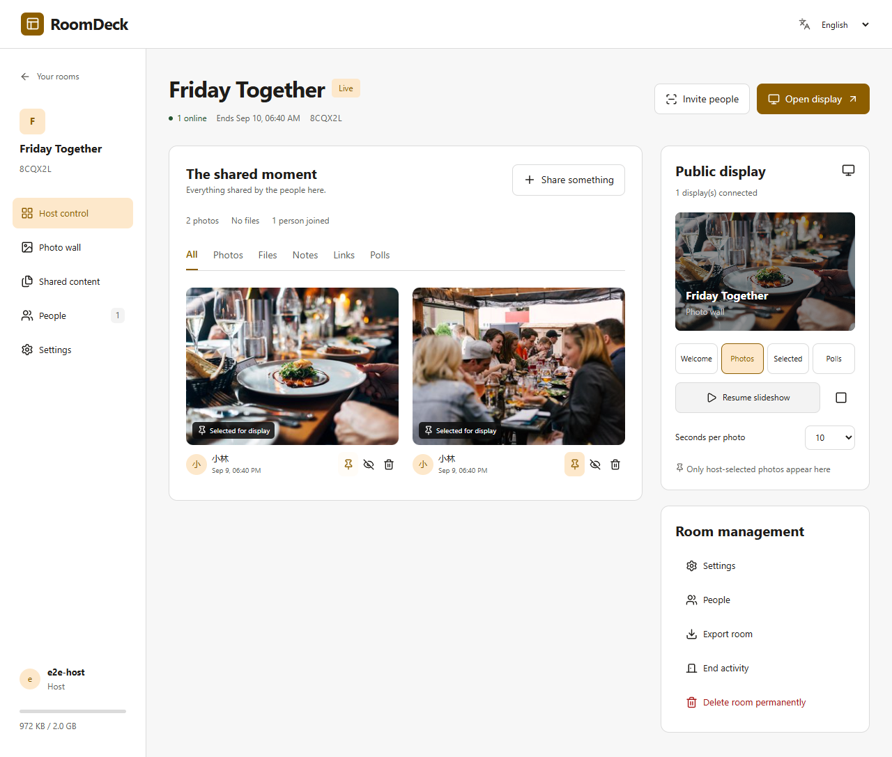
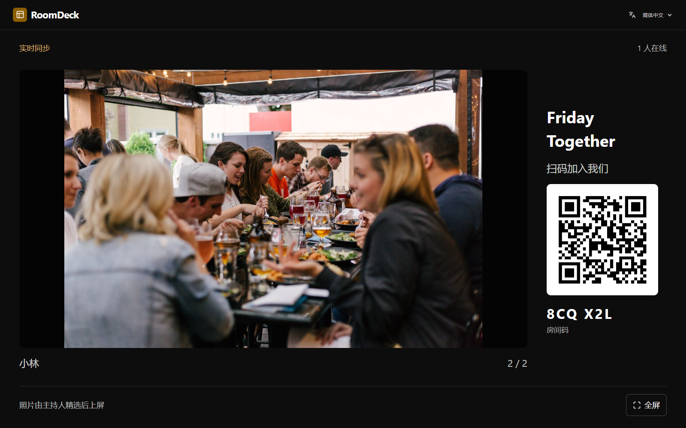
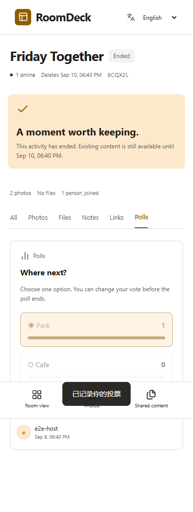
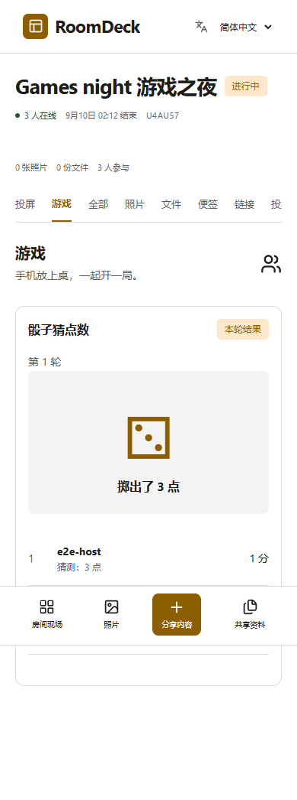
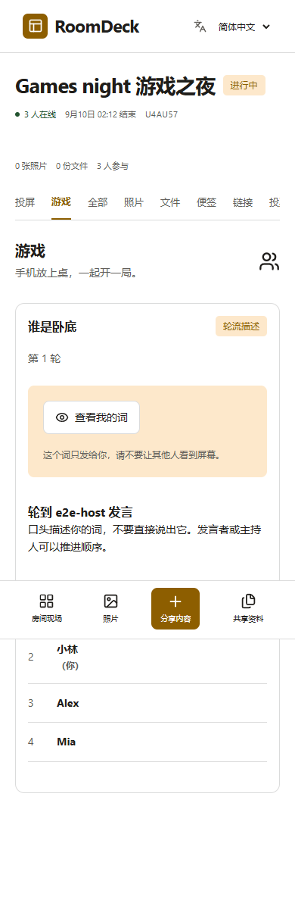

# 开发版验证记录

## 2026-09-11 互动与恢复更新

- 服务端 `go test ./...` 与 `go vet ./...` 通过。新增覆盖：上传分片重启恢复、错误摘要、幂等完成及配额、上屏目标校验与撤销、表情去重、审核隔离、队列批准与超时。
- 前端生产构建与中英翻译检查通过（406 个键）。
- 完整浏览器回归 13 项全部通过，耗时 53.5 秒；包含真实 LiveKit 两位观看者和大屏、分享期间切投票再切回、审批后接棒、刷新只补传缺片、离线草稿、审核互动、响应式及自动无障碍扫描。
- 后续针对大屏布局的两项新功能回归通过（12.9 秒），确认 1280×720 与 1920×1080 的验收投票不需要纵向滚动。
- 文件选择器取消事件曾冒泡关闭原生 dialog，已通过仅处理 dialog 自身 cancel 修复；刷新续传测试已覆盖该路径。
- Linux amd64/arm64、CGO 关闭的最新 Go 交叉构建通过；`docker compose config --quiet` 通过。这些检查不等同于容器运行或多架构镜像验收。
- 测试使用隔离数据目录。实际 Docker 容器、真实手机/电视与满负载性能仍未在本轮验证。下方为历史验证记录，不代表本轮重新执行了全部历史环境检查。

验证日期：2026-09-10。环境：Windows amd64，Go 1.27.1，Node 22.22.2，Chromium 本地无头浏览器，LiveKit 1.13.6。

## 已通过

- 24 项服务端测试：原有分享/权限/生命周期测试、游戏与迁移测试，以及媒体创建失败不占位、清理失败保持撤销并允许继续分享、服务关闭取消媒体请求。
- `go vet ./...`。
- 前端 TypeScript 检查与 Vite 生产构建。
- 中英词典 332 个键与插值变量一致性检查。
- `npm ci` 可重现安装，npm 公共审计接口检查未发现已安装依赖漏洞。
- Linux amd64 与 arm64、CGO 关闭的 Go 构建。
- 真实浏览器多会话流程：英文主持人创建 → 中文访客加入 → 图片上传 → 主持人精选 → 独立大屏显示 → 便签 → 投票 → 黑屏 → ZIP 下载 → 结束 → 语言切换。
- 320/390/768px 访客界面横向溢出检查。
- 回归：大屏暂停期间新增精选照片，不切换当前画面；黑屏同时移除照片和加入二维码。
- 五个浏览器测试全部通过（本轮 19.3 秒）：原有完整分享流程、双语游戏与移动端恢复、真实 SFU 多端收流、超时恢复及双语提示、反向代理 HTML 错误响应恢复。
- 媒体用例：浏览器测试源 → LiveKit → 两个访客与配对大屏，同时收到有效视频帧；主持人停止后各端移除画面；访客可以接着发起，主持人可以终止访客投屏。测试捕获画面由 Chromium 自动化生成，不是实际手机/电视或物理桌面录制。
- 官方 Compose CLI v5.5.1 验证默认配置，以及宿主机映射 + HTTPS + TURN/TLS 合并配置的解析。初始化脚本通过 shell 语法检查。
- 停止投屏请求绑定投屏 ID，旧请求不能终止下一位分享者；对应服务端断言与真实 SFU 用例再次通过。本地 8080 已升级至 v2 数据库，升级前保留了原开发数据目录副本。
- 普通 JSON 请求在 15 秒内未完成会取消等待并恢复按钮，提示先检查最新状态；不自动重发写操作，不影响流式文件上传。媒体服务的 not_found 仅对删除/移除清理视作幂等成功，创建失败不会返回虚假的投屏成功。

截图来自真实服务端数据，不是静态原型：

## 未执行

- Docker daemon 实机 `build/up`（当前设备没有 Docker）。基础镜像标签与架构已核实，CI 已加入容器检查。
- Go race 检测（当前 Windows 未提供 C 工具链；Linux CI 已配置）。
- 真实 iOS/Android/微信内置浏览器、电视浏览器。
- 公网 NAT、强制 TURN/TLS 和真实系统音频捕获；TURN 证书自动续期（本版由管理员证书工具维护）。
- 50 人/多房间压力测试、2 GB 房间导出压力测试、断电与磁盘硬件故障。

以上没有执行的检查不视为通过。此版适合进入本地或测试环境试用，不能将单机浏览器验证等同于大规模活动生产验证。

## 2026-09-11 大屏与统一交互组件

- 前端类型检查与生产构建通过；406 个双语键及插值检查通过。
- 完整 14 项浏览器回归通过（56.0 秒），涵盖真实本地 SFU、多端投屏、上传续传、恢复、游戏、投票、弹幕和响应式界面。
- 新增菜单专项覆盖鼠标选择、键盘选择、Esc 先关菜单后关弹窗、外部点击关闭、390/1280px 位置边界，以及展开菜单与大屏的自动无障碍扫描。
- 最后修正照片说明高度分配后，分享/投票/导出集成测试再次通过（9.3 秒），新增 1280×720 与 1920×1080 的照片说明完整显示和页面高度断言。
- 本次仅修改前端与测试、文档，不新增依赖或部署服务。旧浏览器不支持 Popover 时回退为原生下拉框；手机为浏览器视口模拟，未替代真实触屏或电视验收。
- 实际截图与预览：`docs/display-ui-preview.html`、`docs/screenshots/polish/`。

## 2026-09-12 画板与协同主持

- Go 全量测试与 vet 通过；新增覆盖逐项授权、防止权限覆盖、越权与跨房间拒绝、禁言/撤销生效、笔画身份与幂等、非法坐标、旧画布命令拒绝、答案隐私、积分、防重复猜中、到时揭晓、成员移除取消、数据库重启恢复。
- 前端类型检查、生产构建与 463 个双语键及插值检查通过。
- 完整 15 项 Playwright 测试通过（约 1.1 分钟）。新增真实浏览器操作验证多人笔画、撤销、离线重连、刷新恢复、协同主持创建与推进游戏、猜词与积分、大屏答案隐私、撤销权限后 API 拒绝，以及英文手机自动无障碍检查。
- 大屏 1280×720 与 1920×1080 验证积分栏完整显示，页面不超过视口高度。
- Linux amd64/arm64 无 CGO 编译通过，Compose 配置检查通过。此项不代表实际 Docker 容器、手机或电视硬件验收。
- 本地用户数据升级前已备份至 `.local/backups/before-board-20260912-140726/dev-data`，8080 应用更新至 v7 数据结构。
- 四组实际界面截图见 `docs/collaboration-preview.html`。
